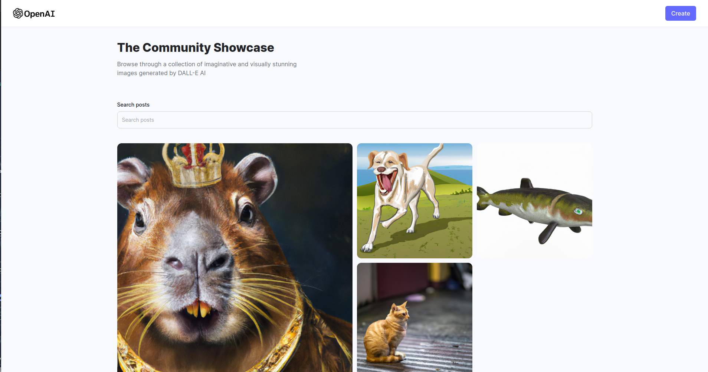

# Ai Image Generator App
## Project Demo
🎇 [Live demo](https://aigeneratorlr.netlify.app/) 🎇

## Description
A mockup project that uses OpenAI API to generate images based on a prompt giben by an user.

## Features
- Allows the creation of AI generated images
- CRUD operations with images to store them on MongoDB

## Technologies Used
- React JS
- Node.js
- Express
- MongoDB
- TailwindCSS

## Credits
Tutorial on YouTube by [JavaScript Mastery](https://www.youtube.com/watch?v=EyIvuigqDoA)